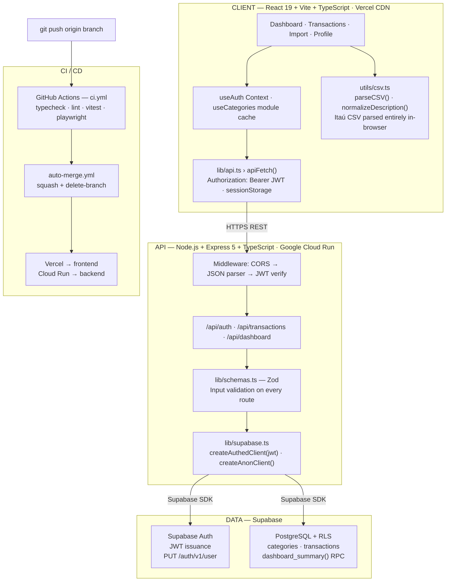

# ⚡ Plutus

Family finance tracker — CSV import, spending dashboards, category management.

## Structure

| Folder | What it is |
|--------|-----------|
| `db/` | Database migrations (SQL scripts for Supabase) |
| `frontend/` | React + Vite + TypeScript SPA |
| `backend/` | Node.js + Express API (proxies Supabase) |
| `e2e/` | Playwright end-to-end tests |

## Stack

- **Database**: PostgreSQL via Supabase (with Row-Level Security)
- **Auth**: Supabase Auth (proxied through backend)
- **Frontend**: React 19 + Vite 8 + TypeScript
- **Backend**: Node.js + Express 5 (credentials never reach the browser)
- **Deploy**: Vercel (frontend) + Google Cloud Run (backend)

## Getting started

```bash
# Backend
cd backend && cp .env.example .env  # fill in SUPABASE_URL and SUPABASE_ANON_KEY
npm install && npm run dev           # http://localhost:3001

# Frontend (separate terminal)
cd frontend && cp .env.example .env # VITE_API_URL=http://localhost:3001
npm install && npm run dev           # http://localhost:5173
```

See `CLAUDE.md` for full architecture details and contribution guidelines.

## Architecture



### Component Explanation

| Component | Responsibility |
|---|---|
| **React Pages** | Each view is an independent component; no router — `App.tsx` controls navigation via `view` state |
| **apiFetch** | Single HTTP wrapper for all API calls — injects JWT and centralises error handling |
| **utils/csv.ts** | Itaú CSV parsing and description normalisation runs entirely in the browser (no file upload) |
| **Express Routes** | Stateless API — each request creates a Supabase client scoped to the user's JWT |
| **Zod Schemas** | Input validation on every route before touching the database |
| **createAuthedClient** | Per-request Supabase client with JWT; database RLS is enforced transparently |
| **Supabase Auth** | Issues JWTs; password change calls `PUT /auth/v1/user` directly via REST (SDK requires a full session) |
| **PostgreSQL RLS** | Row-Level Security enforces per-user data isolation at the database level — no manual filtering in backend |
| **CI/CD** | Three-job pipeline (frontend, backend, e2e); auto-merge + auto-delete-branch after CI passes |
